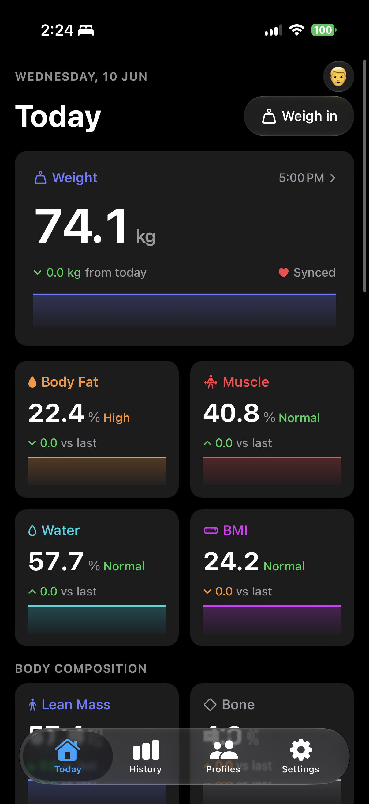
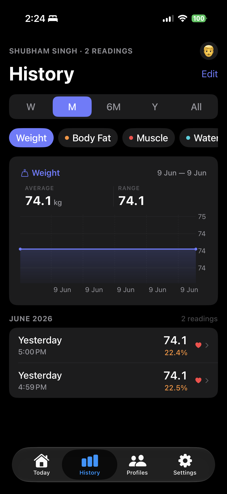
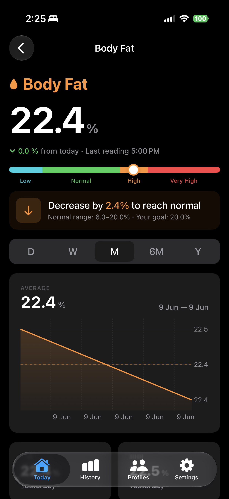
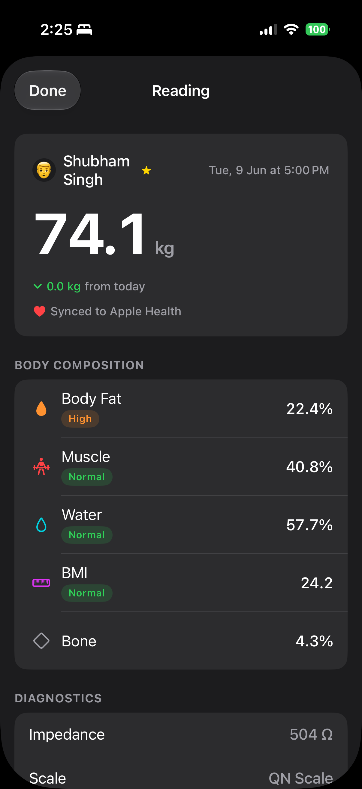

# ScaleBridge

A native iOS app that bridges QN/Yolanda Bluetooth body-composition scales with Apple Health.

Step on your scale — ScaleBridge captures weight, body fat, muscle, water, BMI, bone, and more in one shot, writes them to Apple Health, and tracks your trends over time.

## Screenshots

  
  
  
  

## Features

- **Bluetooth pairing** — auto-connects to QN/Yolanda smart scales (the same hardware used by many white-label apps)
- **Full body composition** — 16 metrics: weight, body fat, muscle %, water %, BMI, lean mass, bone, protein, skeletal muscle, subcutaneous fat, visceral fat, muscle mass, BMR, metabolic age, health score, obesity degree
- **Apple Health sync** — primary profile's readings flow into HealthKit automatically
- **Multi-profile** — add a profile for each family member; the app logs to the right person based on weight
- **Range gauge** — each metric shows a Low / Normal / High / Very High band with a goal hint ("Decrease by 4.3% to reach normal")
- **Trend charts** — history view with per-metric charts across W / M / 6M / Y / All ranges
- **iOS 26 design** — Liquid Glass tab bar, native system colors, SF Symbols throughout

## Requirements

- iOS 26+
- Xcode 26+
- A QN/Yolanda-compatible Bluetooth body-composition scale — tested with the **HealthifyMe Smart Scale**

## Building

1. Clone the repo
2. Open `ScaleBridge.xcodeproj` in Xcode
3. Select your device as the build target (Bluetooth requires a real device)
4. Build & run — no third-party dependencies, no package manager needed

## Body Composition Algorithms

The body composition formulas (body fat %, lean mass, BMR via Katch-McArdle, metabolic age) are derived from the [openScale](https://github.com/oliexdev/openScale) project. openScale is the reference open-source implementation for QN/Yolanda scale parsing and body composition math.

## License

ScaleBridge is licensed under the [GNU General Public License v3.0](LICENSE), consistent with its dependency on openScale (GPL v3).
